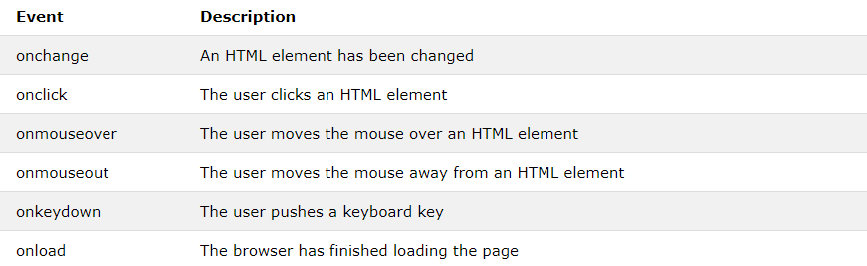

# Forms

Traditionally, the term 'form' has referred
to a printed document that contains
spaces for you to fill in information.

HTML borrows the concept of a form to refer to different
elements that allow you to collect information from visitors to
your site.

**Why Forms?**

The best known form on the web is probably
the search box that sits right in the middle of
Google's homepage.

**Form Controls**
There are several types of form controls that
you can use to collect information from visitors
to your site.

**ADDING TEXT:**

Text input (single-line)

Used for a single line of text such
as email addresses and names.

Password input

Like a single line text box but it
masks the characters entered.

Text area (multi-line)

For longer areas of text, such as
messages and comments.

**Making Choices:**

Radio buttons

For use when a user must select
one of a number of options.

Checkboxes

When a user can select and
unselect one or more options.

Drop-down boxes

When a user must pick one of a
number of options from a list.

**Submitting Forms:**

Submit buttons

To submit data from your form
to another web page.

Image buttons

Similar to submit buttons but
they allow you to use an image.

**Uploading Files:**

File upload

Allows users to upload files
(e.g. images) to a website.

**How Forms Work**

A user fills in a form and then presses a button
to submit the information to the server.

The name of each form
control is sent to the
server along with the
value the user enters or
selects.

The server processes
the information using a
programming language
such as PHP, C#, VB.net,
or Java. It may also store
the information in a
database.

The server creates a new
page to send back to the
browser based on the
information received.

A form may have several form controls, each
gathering different information. The server
needs to know which piece of inputted data
corresponds with which form element.

username=Ivy
name=value

To differentiate between various pieces of inputted data, information
is sent from the browser to the server using name/value pairs. In this
example, the form asks for the visitor's username and also for their
favorite jazz musician. The name/value pairs sent to the server are:

username=Ivy

If the form control allows the
user to enter text, then the value
of the form control is whatever
the user has typed in.

vote=Herbie

If the form control allows you
to choose from a fixed set of
answers (e.g. radio buttons,
checkboxes or a drop down list),
the web page author will add
code that gives each option an
automatic value.

You should never change the name of a form control in a page unless
you know that the code on the server will understand this new value.

**Form Structure**

`<form>`

Form controls live inside a
`<`form>` element. This element
should always carry the action
attribute and will usually have a
method and id attribute too.

action

Every `<form>` element requires
an action attribute. Its value
is the URL for the page on the
server that will receive the
information in the form when it
is submitted.

method

Forms can be sent using one of
two methods: get or post.

With the get method, the values
from the form are added to
the end of the URL specified in
the action attribute. The get
method is ideal for:

● short forms (such as search
boxes).

● when you are just retrieving
data from the web server
(not sending information that
should be added to or deleted
from a database).

With the post method the
values are sent in what are
known as HTTP headers. As a
rule of thumb you should use the
post method if your form:

● allows users to upload a file
● is very long.

● contains sensitive data
(e.g. passwords).

● adds information to, or
deletes information from, a
database.

If the method attribute is not
used, the form data will be sent
using the get method.

id

We look at the id attribute on
page 183, but the value is used to
identify the form distinctly from
other elements on the page (and
is often used by scripts — such
as those that check you have
entered information into fields
that require values).

**Text Input**

`<input>`

The `<input>` element is used
to create several different form
controls. The value of the type
attribute determines what kind
of input they will be creating.

type="text"

When the type attribute has a
value of text, it creates a singleline text input.

name

When users enter information
into a form, the server needs to
know which form control each
piece of data was entered into.
(For example, in a login form, the
server needs to know what has
been entered as the username
and what has been given as the
password.) Therefore, each form
control requires a name attribute.
The value of this attribute
identifies the form control and is
sent along with the information
they enter to the server.

size

The size attribute should not
be used on new forms. It was
used in older forms to indicate
the width of the text input
(measured by the number of
characters that would be seen).

maxlength

You can use the maxlength
attribute to limit the number
of characters a user may enter
into the text field. Its value is the
number of characters they may
enter. For example, if you were
asking for a year, the maxlength
attribute could have a value of 4.

Password Input

`<input>`

type="password"
When the type attribute has
a value of password it creates
a text box that acts just like a
single-line text input, except
the characters are blocked out.
They are hidden in this way so
that if someone is looking over
the user's shoulder, they cannot
see sensitive data such as
passwords.

name

The name attribute indicates
the name of the password input,
which is sent to the server with
the password the user enters.

size, maxlength

It can also carry the size and
maxlength attributes like the
the single-line text input.

**Text Area**

`<textarea>`
The `<textarea>` element
is used to create a mutli-line
text input. Unlike other input
elements this is not an empty
element. It should therefore have
an opening and a closing tag.
Any text that appears between
the opening `<textarea>` and
closing `</textarea>` tags will
appear in the text box when the
page loads.
If the user does not delete any
text between these tags, this
message will get sent to the
server along with whatever the
user has typed. (Some sites
use JavaScript to clear this
information when the user clicks
in the text area.)

**Radio Button**

`<input>`

type="radio"

Radio buttons allow users to pick
just one of a number of options.

name

The name attribute is sent to
the server with the value of the
option the user selects. When
a question provides users with
options for answers in the form
of radio buttons, the value of
the name attribute should be the
same for all of the radio buttons
used to answer that question.

value

The value attribute indicates
the value that is sent to the
server for the selected option.
The value of each of the buttons
in a group should be different
(so that the server knows which
option the user has selected).

checked

The checked attribute can be
used to indicate which value (if
any) should be selected when
the page loads. The value of this
attribute is checked. Only one
radio button in a group should
use this attribute.

**Checkbox**

`<input>`

type="checkbox"

Checkboxes allow users to select
(and unselect) one or more
options in answer to a question.

name

The name attribute is sent to
the server with the value of the
option(s) the user selects. When
a question provides users with
options for answers in the form
of checkboxes, the value of the
name attribute should be the
same for all of the buttons that
answer that question.

value

The value attribute indicates
the value sent to the server if this
checkbox is checked.

checked

The checked attribute indicates
that this box should be checked
when the page loads. If used, its
value should be checked.

**Drop Down List Box**

`<select>`
A drop down list box (also
known as a select box) allows
users to select one option from a
drop down list.
The `<select>` element is used
to create a drop down list box. It
contains two or more `<option>`
elements. 

name

The name attribute indicates the
name of the form control being
sent to the server, along with the
value the user selected.

`<option>`

The `<option>` element is used
to specify the options that the
user can select from. The words
between the opening `<option>`
and closing `</option>` tags will
be shown to the user in the drop
down box.

value

The `<option>` element uses the
value attribute to indicate the
value that is sent to the server
along with the name of the
control if this option is selected.

selected

The selected attribute can be
used to indicate the option that
should be selected when the
page loads. The value of this
attribute should be selected.
If this attribute is not used,
the first option will be shown
when the page loads. If the user
does not select an option, then
the first item will be sent to
the server as the value for this
control.

The function of the drop down
list box is similar to that of the
radio buttons (in that only one
option can be selected). There
are two key factors in choosing
which to use:

1. If users need to see all options
at a glance, radio buttons are
better suited.

2. If there is a very long list
of options (such as a list of
countries), drop down list boxes
work better.

*Multiple Select Box**

`<select>`

size

You can turn a drop down select
box into a box that shows more
than one option by adding the
size attribute. Its value should
be the number of options you
want to show at once. In the
example you can see that three
of the four options are shown.
Unfortunately, the way that
browsers have implemented this
attribute is not perfect, and it
should be tested throroughly if
used (in particular in Firefox and
Safari on a Mac). 

multiple

You can allow users to select
multiple options from this list by
adding the multiple attribute
with a value of multiple. 

**File Input Box**

`<input>`

If you want to allow users to
upload a file (for example an
image, video, mp3, or a PDF),
you will need to use a file input
box.

type="file"

This type of input creates a
box that looks like a text input
followed by a browse button.
When the user clicks on the
browse button, a window opens
up that allows them to select a
file from their computer to be
uploaded to the website.

**Submit Button**

`<input>`

type="submit"

The submit button is used to
send a form to the server.

name

It can use a name attribute but it
does not need to have one.

value

The value attribute is used to
control the text that appears
on a button. It is a good idea to
specify the words you want to
appear on a button because the
default value of buttons on some
browsers is ‘Submit query’ and
this might not be appropriate for
all kinds of form.

**Image Button**

`<input>`

type="image"

If you want to use an image for
the submit button, you can give
the type attribute a value of
image. The src, width, height,
and alt attributes work just
like they do when used with the
`` element.

**Button & hidden
Controls**

`<button>`
The `<button>` element was
introduced to allow users more
control over how their buttons
appear, and to allow other
elements to appear inside the
button.

This means that you can
combine text and images
between the opening `<button>`
tag and closing `</button>` tag.

`<input>`

type="hidden"

This example also shows a
hidden form control. These form
controls are not shown on the
page (although you can see them
if you use the View Source option
in the browser). They allow web
page authors to add values to
forms that users cannot see.
For example, a web page author
might use a hidden field to
indicate which page the user was
on when they submitted a form.

**Labelling Form
Controls**

`<label>`
When introducing form controls,
the code was kept simple by
indicating the purpose of each
one in text next to it. However,
each form control should have
its own `<label>` element as this
makes the form accessible to
vision-impaired users.

The `<label>` element can be
used in two ways. It can:

1. Wrap around both the text
description and the form input
(as shown on the first line of the
example to your right).

2. Be kept separate from the
form control and use the for
attribute to indicate which form
control it is a label for (as shown
with the radio buttons).

for

The for attribute states which
form control the label belongs to.
Note how the radio buttons use
the id attribute. The value of the
id attribute uniquely identifies an
element from all other elements
on a page. 

The value of the for attribute
matches that of the id attribute
on the form control it is labelling.
This technique using the for and
id attributes can be used on any
form control. When a `<label>`
element is used with a checkbox
or radio button, users can click
on either the form control or the
label to select. The expanded
clickable area makes the form
easier to use. The position of the
label is very important. If users
do not know where to enter
information or what information
to enter, they are less likely to
use the form correctly. 

As a rule of thumb, here are the
best places to place labels on
form controls.

Above or to the left:

● Text inputs
● Text areas
● Select boxes
● File uploads

To the right:

● Individual checkboxes
● Individual radio buttons

**Grouping Form
Elements**

`<fieldset>`

You can group related form
controls together inside the
`<fieldset>` element. This is
particularly helpful for longer
forms.

Most browsers will show the
fieldset with a line around
the edge to show how they are
related. The appearance of these
lines can be adjusted using CSS.

`<legend>`

The `<legend>` element can
come directly after the opening
`<fieldset>` tag and contains a
caption which helps identify the
purpose of that group of form
controls

**HTML5: Form Validation**

You have probably seen forms
on the web that give users
messages if the form control has
not been filled in correctly; this is
known as form validation.

Traditionally, form validation
has been performed using
JavaScript (which is beyond the
scope of this book). But HTML5
is introducing validation and
leaving the work to the browser.

Validation helps ensure the
user enters information in a
form that the server will be able
to understand when the form
is submitted. Validating the
contents of the form before it is
sent to the server the helps:

● Reduce the amount of work
the server has to do

● Enables users to see if there
are problems with the form
faster than if validation were
performed on the server.

At the time of writing, only
Chrome and Opera supported
HTML5 validation, although other
browsers are expected to follow.
In order to support older browsers
(that do not understand HTML5),
web page authors are likely to
continue using JavaScript to
validate form.

An example of HTML5 form
validation is the required
attribute, which can be used on
any form element that the user
is expected to fill in. This HTML5
attribute does not need a value,
but in HTML 4 all attributes must
have a value. So, some people give
this attribute a value of required.

**HTML5: Date Input**

`<input>`
Many forms need to gather
information such as dates, email
addresses, and URLs. This has
traditionally been done using
text inputs.

HTML5 introduces new form
controls to standardize the
way that some information is
gathered. Older browsers that
do not recognize these inputs
will just treat them as a single
line text box. 

type="date"

If you are asking the user for a
date, you can use an `<input>`
element and give the type
attribute a value of date.
This will create a date input in
browsers that support the new
HMTL5 input types. 

**HTML5: Email & URL Input**

`<input>`

HTML5 has also introduced
inputs that allow visitors to
enter email addresses and URLs.
Browsers that do not support
these input types will just treat
them as text boxes.

type="email"

If you ask a user for an email
address, you can use the email
input. Browsers that support
HTML5 validation will check
that the user has provided
information in the correct format
of an email address. Some smart
phones also optimize their
keyboard to display the keys you
are most likely to need when
entering an email address (such
as the @ symbol).

type="url"

A URL input can be used when
you are asking a user for a web
page address. Browsers that
support HTML5 validation will
check that the user has provided
information in the format of
a URL. Some smart phones
also optimize their keyboard to
display the keys you are most
likely to need when entering a
URL.

**HTML5: Search Input**

`<input>`

If you want to create a single
line text box for search queries,
HTML5 provides a special type
of input for that purpose.

type="search"

If you want to create a single
line text box for search queries,
HTML5 provides a special
search input.

To create the HTML5 search box
the `<input>` element should
have a type attribute whose
value is search. Older browsers
will simply treat it like a single
line text box.

Recent browsers add some
features that improve usability.
For example, Safari on a Mac
adds a cross to clear the search
box when you have started to
enter information. Safari also
automatically rounds the corners
on the search input field.

placeholder

On any text input, you can
also use an attribute called
placeholder whose value is
text that will be shown in the
text box until the user clicks in
that area. Older browsers simply
ignore this attribute.

# Lists, Tables and Forms

There are several CSS properties that
were created to work with specific types
of HTML elements, such as lists, tables,
and forms.

**Bullet Point Styles**

The list-style-type property
allows you to control the shape
or style of a bullet point (also
known as a marker).
It can be used on rules that
apply to the `<ol>`,`<ul>`, and `<li>`
elements.

Unordered Lists

For an unordered list you can use
the following values:

 * none

* disc

* circle

* square

 Ordered Lists

For an ordered (numbered) list
you can use the following values:

decimal
1 2 3

decimal-leading-zero
01 02 03

lower-alpha
a b c

upper-alpha
A B C

lower-roman
i. ii. iii.

upper-roman
I II III

**Images for Bullets**

You can specify an image to act
as a bullet point using the
list-style-image property.

The value starts with the letters
url and is followed by a pair
of parentheses. Inside the
parentheses, the path to the
image is given inside double
quotes.

This property can be used on
rules that apply to the `<ul>` and
`<li>` elements.

**Positioning the Marker**

Lists are indented into the page
by default and the list-styleposition property indicates
whether the marker should
appear on the inside or the
outside of the box containing the
main points.

This property can take one of
two values:

outside

The marker sits to the left of the
block of text. (This is the default
behaviour if this property is not
used.)

inside

The marker sits inside the box of
text (which is indented).

**List Shorthand**

As with several of the other CSS
properties, there is a property
that acts as a shorthand for list
styles. It is called list-style,
and it allows you to express
the markers' style, image and
position properties in any order.

**Table Properties**

You have already met several
properties that are commonly
used with tables. Here we will
put them together in a single
example using the following:

width 
to set the width of the table.

padding
 to set the space
between the border of each table
cell and its content.

text-transform to convert the
content of the table headers to
uppercase.

letter-spacing, font-size
to add additional styling to the
content of the table headers.

border-top, border-bottom
to set borders above and below
the table headers.

text-align to align the writing
to the left of some table cells and
to the right of the others.

background-color to change
the background color of the
alternating table rows.

:hover to highlight a table row
when a user's mouse goes over it.

Here are some tips for styling
tables to ensure they are clean
and easy to follow:

Give cells padding

If the text in a table cell either
touches a border (or another
cell), it becomes much harder to
read. Adding padding helps to
improve readability.

Distinguish headings

Putting all table headings in
bold (the default style for the
`<th>` element) makes them
easier to read. You can also
make headings uppercase and
then either add a background
color or an underline to clearly
distinguish them from content.

Shade alternate rows

Shading every other row can
help users follow along the lines.
Use a subtle distinction from the
normal color of the rows to keep
the table looking clean.

Align numerals

You can use the text-align
property to align the content
of any column that contains
numbers to the right, so that
large numbers are clearly
distinguished from smaller ones.

Online extra

There are more examples of
using CSS to style tables in the
tools section of the website.

**Border on Empty Cells**

If you have empty cells in
your table, then you can use
the empty-cells property to
specify whether or not their
borders should be shown.
Since browsers treat empty cells
in different ways, if you want to
explicitly show or hide borders
on any empty cells then you
should use this property.

It can take one of three values:

show

This shows the borders of any
empty cells.

hide

This hides the borders of any
empty cells.

inherit

If you have one table nested
inside another, the inherit
value instructs the table cells to
obey the rules of the containing
table.

**Gaps Between Cells**

The border-spacing property
allows you to control the
distance between adjacent cells.
By default, browsers often leave
a small gap between each table
cell, so if you want to increase
or decrease this space then
the border-spacing property
allows you to control the gap.

The value of this property is
usually specified in pixels. You
can specify two values if desired
to specify separate numbers for
horizontal and vertical spacing.

When a border has been used
on table cells, where two cells
meet, the width of lines would be
twice that of the outside edges.
It is possible to collapse adjacent
borders to prevent this using the
border-collapse property.

Possible values are:

collapse

Borders are collapsed into a
single border where possible.
(border-spacing will be
ignored and cells pushed
together, and empty-cells
properties will be ignored.)

separate

Borders are detached from each
other. (border-spacing and
empty-cells will be obeyed.)

**Styling Forms**

Nobody I know enjoys filling
in forms, so if you can make
yours look more attractive and
easier to use, more people are
likely to fill it in. Also, when you
come to look at a form in a few
different browsers (as shown
on the right), you will see that
each browser displays them
differently.

CSS is commonly used to
control the appearance of form
elements. This is both to make
them more attractive and to
make them more consistent
across different browsers

 It is most common to style:
● Text inputs and text areas
● Submit buttons
● Labels on forms, to get the
form controls to align nicely

**Styling Text Inputs**

This example demonstrates the
CSS properties commonly used
with text inputs, most of which
you have already met.

font-size sets the size of the
text entered by the user.

color sets the text color, and
background-color sets the
background color of the input.

border adds a border around
the edge of the input box, and
border-radius can be used
to create rounded corners (for
browsers that support this
property).

The :focus pseudo-class is
used to change the background
color of the text input when it
is being used, and the :hover
psuedo-class applies the same
styles when the user hovers over
them.

background-image adds a
background image to the box.
Because there is a different
image for each input, we are
using an attribute selector
looking for the value of the id
attribute on each input.

**Styling Submit Buttons**

Here are some properties that
can be used to style submit
buttons. This example builds
on the one in the previous page,
and the submit button inherits
the styles set for the `<input>`
element on the last page.

color is used to change the
color of the text on the button.

text-shadow can give a 3D
look to the text in browsers that
support this property.

border-bottom has been used
to make the bottom border of
the button slightly thicker, which
gives it a more 3D feel.

background-color can make
the submit button stand out
from other items around it.
(Creating a consistent style
for all buttons helps users
understand how they should
interact with the site.) A gradient
background has been added for
browsers that support gradients.
Gradients are covered on
page 419.

The :hover pseudo-class
has been used to change the
appearance of the button when
the user hovers over it. In this
case, the background changes,
the text gets darker, and the
thicker border is applied to the
top of the button.

**Styling Fieldsets
& Legends**

Fieldsets are particularly helpful
in determining the edges of a
form. In a long form they can
help group together related
information within it.

The legend is used to indicate
what information is required in
the fieldset.

Properties commonly used with
these two elements include:

width is used to control
the width of the fieldset. In
this example, the width of
the fieldset forces the form
elements to wrap onto a new line
in the correct place. (If it were
wider, the items might sit on one
line.)

color is used to control the
color of text.

background-color is used to
change the color behind these
items.

border is used to control the
appearance of the border around
the fieldset and/or legend.

border-radius is used to
soften the edges of these
elements in browsers that
support this property.

padding can be used to add
space inside these elements

**Aligning Form Controls: Problem**

Labels for form elements are
often different lengths, which
means that the form controls will
not appear in a straight line.

**Aligning Form
Controls: Solution**

Each row of the form has a title
telling users what they need to
enter. For the text inputs, the
title is in the `<label>` element.
For the radio buttons, the title is
in a `` element. Both have
a class attribute with a value of
title. 

We can use a property called
float to move the titles to the
left of the page.

By setting the width property
on those elements, we know that
the titles will each take up the
same width. Therefore, the form
controls next to them will line up.

**Cursor Styles**

The cursor property allows
you to control the type of mouse
cursor that should be displayed
to users.

For example, on a form you
might set the cursor to be a hand
when the user hovers over it.
Here are the most commonly
used values for this property:

* auto

* crosshair

* default

* pointer

* move

* text

* wait

* help

* url("cursor.gif");

**Web Developer
Toolbar**

This helpful extension for Firefox and Chrome
provides tools to show you the CSS styles that
apply to an element when you hover over it,
along with the structure of the HTML.

# Events

When you browse the web, your browser registers different
types of events. It's the browser's way of saying, "Hey, this
just happened." Your script can then respond to these events.

Scripts often respond to these events by updating the content of the web page (via the
Document Object Model) which makes the page feel more interactive.

HTML events are "things" that happen to HTML elements.

When JavaScript is used in HTML pages, JavaScript can "react" on these events.

HTML Events

An HTML event can be something the browser does, or something a user does.

Here are some examples of HTML events:

An HTML web page has finished loading
An HTML input field was changed
An HTML button was clicked

Often, when events happen, you may want to do something.

JavaScript lets you execute code when events are detected.

HTML allows event handler attributes, with JavaScript code, to be added to HTML elements.

With single quotes:

<element event='some JavaScript'>

With double quotes:

<element event="some JavaScript">

JavaScript code is often several lines long. It is more common to see event attributes calling functions:

Here is a list of some common HTML events:

Event handlers can be used to handle and verify user input, user actions, and browser actions:

Things that should be done every time a page loads
Things that should be done when the page is closed
Action that should be performed when a user clicks a button
Content that should be verified when a user inputs data
And more ...

Many different methods can be used to let JavaScript work with events:

HTML event attributes can execute JavaScript code directly
HTML event attributes can call JavaScript functions
You can assign your own event handler functions to HTML elements
You can prevent events from being sent or being handled
And more ...

